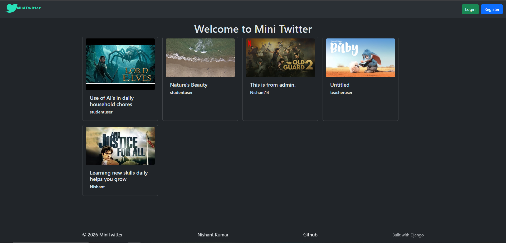
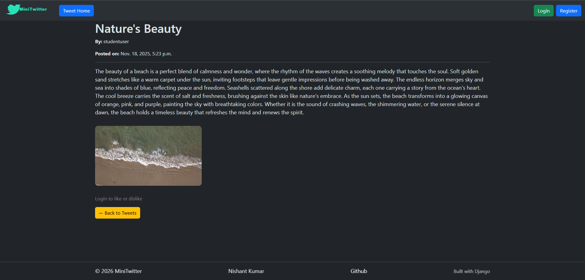
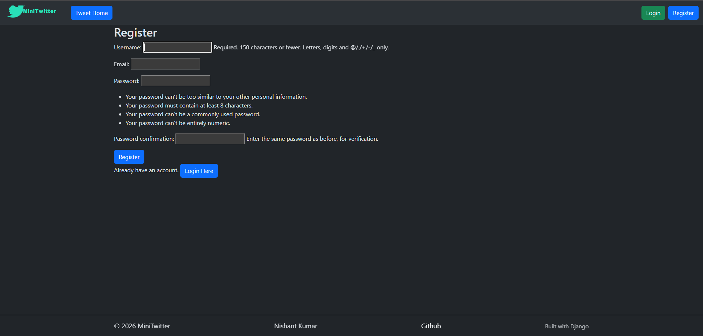
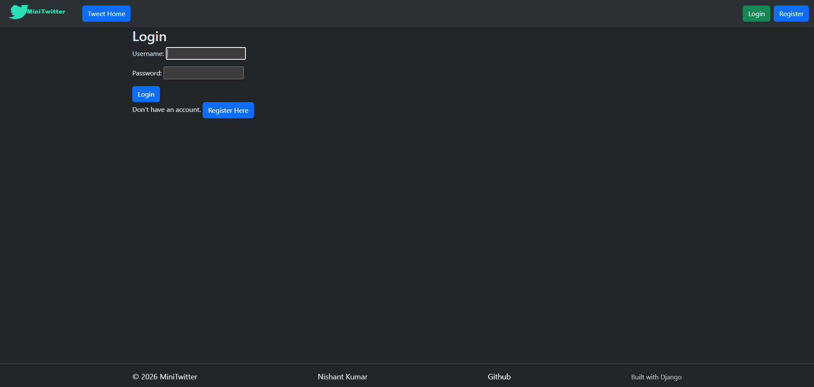
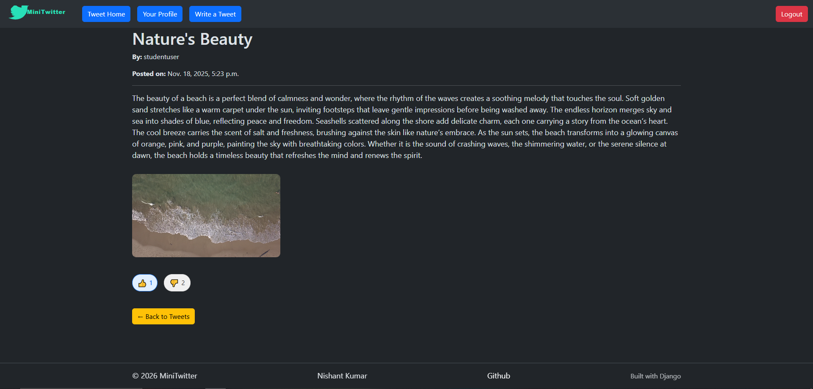

# 🐦 Mini Twitter

Mini Twitter is a simple social media web application where users can post tweets, like or dislike tweets, upload photos/videos, and manage their profile. It mimics basic Twitter functionality with a lightweight and easy-to-use interface.


## Features

- User Authentication

- Register and login to interact with the platform.

- Change password from profile.

- Tweet Management

- Create tweets with text content.

- Upload photos or videos with tweets.

- View all your own tweets in the profile.

- Tweet Interaction

- Like or dislike tweets (only after login).

- View your liked and disliked tweets in your profile.

- Profile Management

- View profile with all your tweets.

- Track liked and disliked tweets.

- Update password.

## Technology Stack

- Backend: Django (Python)

- Frontend: HTML, CSS, JavaScript

- Database: SQLite (default for Django projects)

- Media Handling: Django Media system (for images and videos)

## Installation

1. Clone the repository:
``` bash
git clone <repository_url>
cd mini-twitter
```

2. Create a virtual environment:
``` bash
python -m venv venv
source venv/bin/activate   # Windows: venv\Scripts\activate
```

3. Install dependencies:
``` bash 
pip install -r requirements.txt
```

4. Apply migrations:
``` bash
python manage.py migrate
```

5. Run the development server:
``` bash 
python manage.py runserver
```

6. Open the application in a browser:
``` bash
http://127.0.0.1:8000/
```
## Usage

- Register or login to your account.

- Create a tweet with text, photo, or video.

- Like or dislike tweets by other users.

- Visit your profile to:

- See your tweets

- View liked and disliked tweets

- Change your password

## Screenshots
1. Home page

2. User's Tweet

3. Register page

4. Login Page

5. Like & Dislike

## Future Enhancements

- Add comments on tweets.

- Real-time notifications for likes and new tweets.

- Hashtags and trending topics.

- Follow/unfollow functionality between users.
